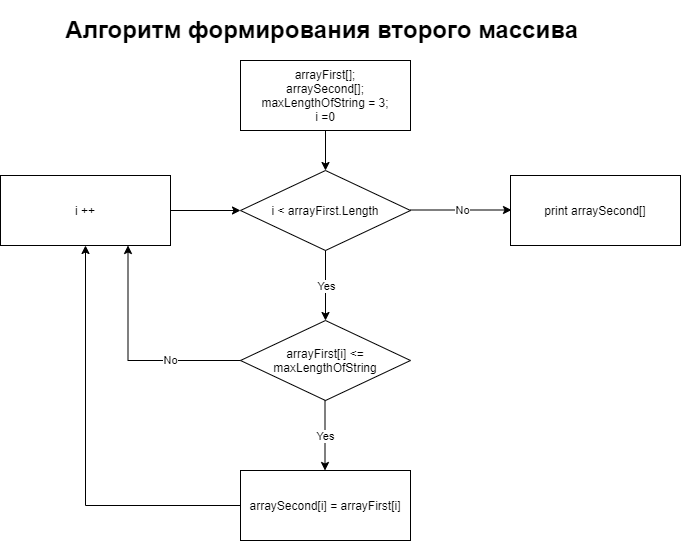

## Что это?
___

Это программа, которая из имеющегося массива строк формирует массив из строк, длина которых меньше либо равна 3 символа. 

## Описание
___

Длина первоначального массива и его элементы задаются пользователем с клавиатуры. Второй массив формируется согласно алгоритму:

Далее, оба массива выводятся на печать через метод.

## Мой репозиторий
___

Вы можете найти мой репозиторий по ссылке: 

[My repo](https://github.com/PolinaBrag/FinalTestWork)

## Создатели
___

Проект создан _**Брагиной Полиной**_.